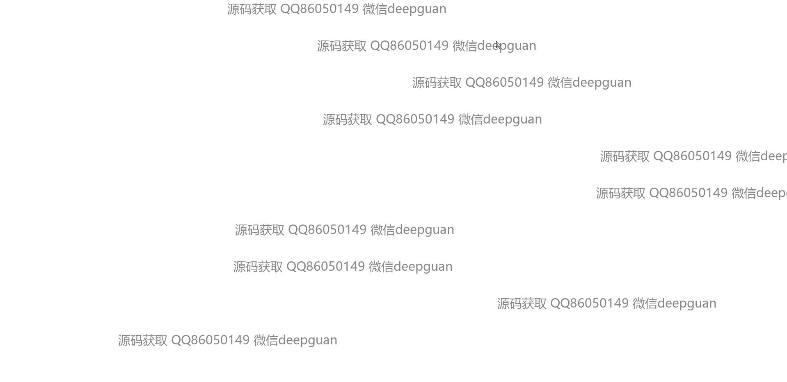

<h1 align="center">医院门诊互联电子病历管理信息系统</h1>

## 简介
医院门诊互联电子病历管理信息系统：角色分为管理员和医生；支持预约信息管理、检查报告管理、药品信息管理、电子病历管理等功能模块，提升医疗信息化效率。    --计算机毕业设计源码；毕设源码；java毕业设计源码

## 联系方式

<h3 align="center">获取完整代码与数据库文件 + 微信：deepguan QQ: 86050149 QQ群: 783742310</h3>

<h3 align="center">可帮忙远程部署 包运行成功！提供远程部署、修改代码、设计文档指导、代码讲解等服务！</h3>

## 功能介绍（完整见运行截图）
管理员：登录、注册、退出，后台管理系统，包括用户管理、医生管理、药品管理、项目分类管理、预约信息管理和公告发布，支持新增、修改、删除和详情查看，提供统计数据与分析功能。

医生：登录系统，查看和管理患者信息，操作检查报告、电子病历记录和药品信息管理，支持病历编辑、诊断信息录入及药品开药功能，快速获取患者健康数据。

患者：注册、登录，访问个人中心，管理个人预约信息，查看检查报告和历史病历记录，支持信息查询和分类管理，在线获取医院公告与通知。

系统操作员：负责系统的整体维护，包括上传医院相关图片、管理轮播图、设置系统导航和模块权限，优化用户体验和确保系统功能稳定运行。

## 运行截图

本代码来源于网络,仅供学习参考使用!

